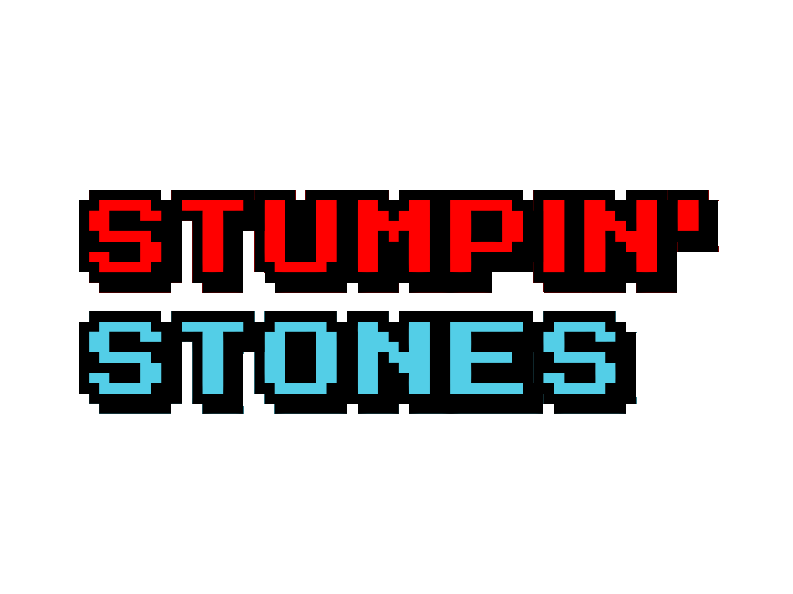
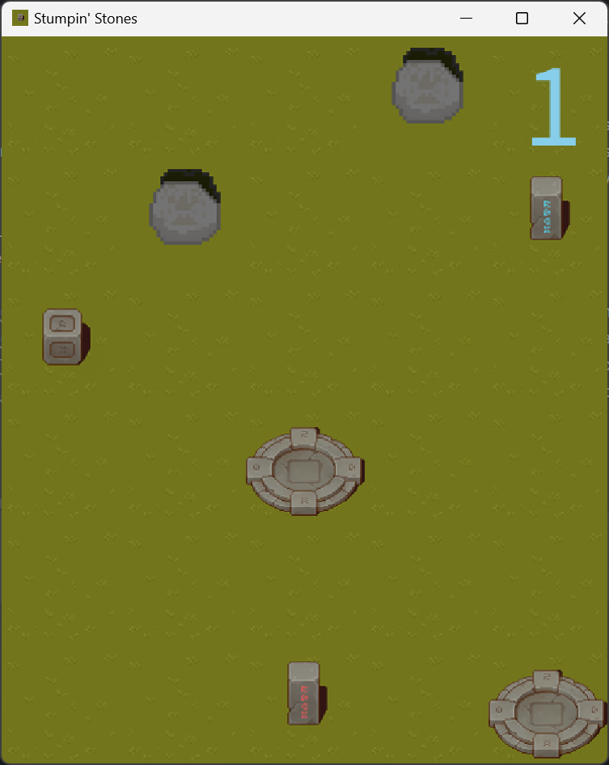
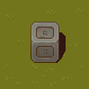
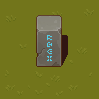
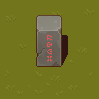
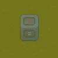
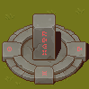
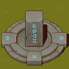
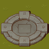

By Dean Tumabcao & Alan for a high school assignment. Coded with Java and love. Uploaded to GitHub for archival.

# Version 1.1.0

**Latest Minor**
* Added a modern README
* Made changes to asset names
* Added icons to and changed name of window

## About
A 2D top-down tile puzzle video game where you can solve _randomly-generated_ leveled puzzles.
### 📷 Screenshots

### 📖 Stumpin' Stones Guide
#### 👋 Introduction
Welcome to **Stumpin' Stones**! In this video game, you control a stone cube called the  Admin Cube. It lives in the flat world of Tile Land. 
It has the power to move two   Stone Statues of two colors in the same and opposite direction of its own movement.
Move the Stone Statues to their color-respective Destination tiles to progress to the next level.
#### 🖐️ How To Interact
* 🖱️ Click on the Admin Cube tile to show its possible moves.
* 🚶 Click on one of its adjacent  blue-tinted clones to move the Admin Cube to that tile.
#### 🧩 The Fundamentals
*   ⬅️ End with THIS to progress to the next level!
*  The Red Statue moves in the SAME direction as the Admin Cube.
*  The Blue Statue moves in the OPPOSITE direction as the Admin Cube.
*  Destinations are structures that when sitting below a Statue, each activate 1/2 of a level objective.

#### Try your luck and don't get stuck! 😏